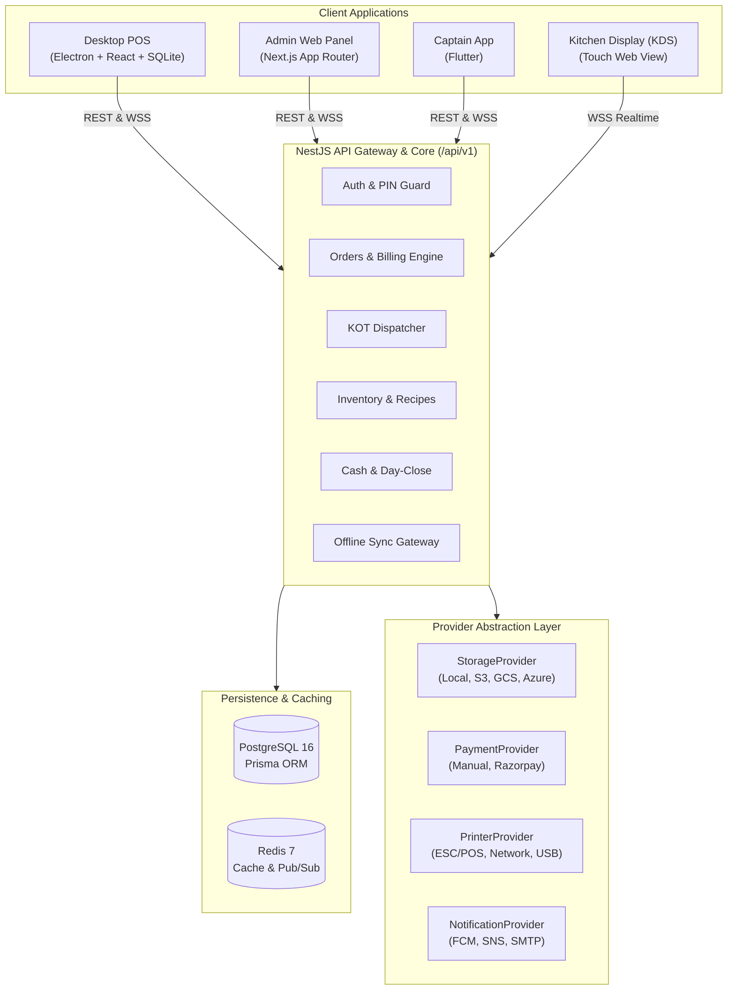

# RestoVyn Technical Architecture

## 1. Domain Separation & Clean Architecture

1. **Transport Layer**:
   - Controllers handle HTTP routing, query parsing, and OpenAPI annotations.
   - WebSockets gateway manages client connections and broadcasts domain events (`ORDER_CREATED`, `TABLE_UPDATED`, `KOT_READY`, etc.).
2. **Business Rules Layer**:
   - Resides in `@restovyn/business-rules`. Pure TypeScript functions with 0 framework or DB dependencies.
   - Calculates line items, subtotal, tax breakdowns (inclusive and exclusive), service charges, discounts, and split bills strictly in **integer minor units**.
3. **Application & Persistence Layer**:
   - NestJS Services manage transactions, optimistic concurrency, and Prisma client interactions.
   - All mutations write to `AuditLog` when critical operations occur (e.g. `ORDER_ITEM_CANCEL`, `PAYMENT_REFUND`, `TABLE_TRANSFER`, `DAY_CLOSE`).
