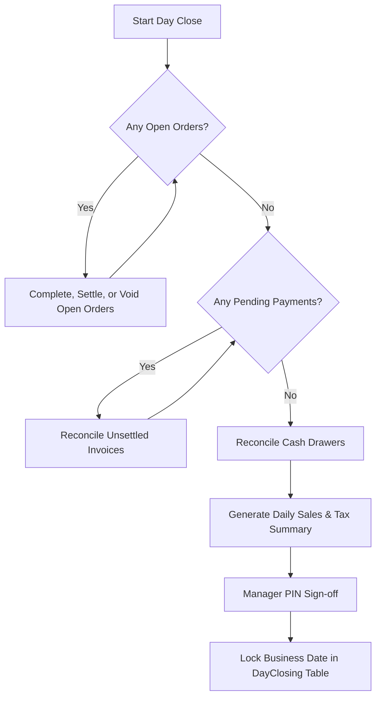

# Cash Management & Day Closing Architecture

## 1. Cash Session Balance Formula

Cash register drawer sessions enforce:

$$\text{Expected Closing Cash} = \text{Opening Cash} + \text{Cash Sales} - \text{Cash Refunds} - \text{Cash Expenses} \pm \text{Adjustments}$$

At shift close:

- Cashier counts actual drawer cash.
- System records:
  - `openingCash`
  - `expectedClosing`
  - `closingCash` (actual)
  - `difference = closingCash - expectedClosing`
  - `closedById` and timestamp.
- Drawer discrepancies are flagged for manager audit.

---

## 2. Manager Day-Closing Process

Once closed, transactions for that business date are locked against normal modification.
Reversals require explicit authorized procedures.
