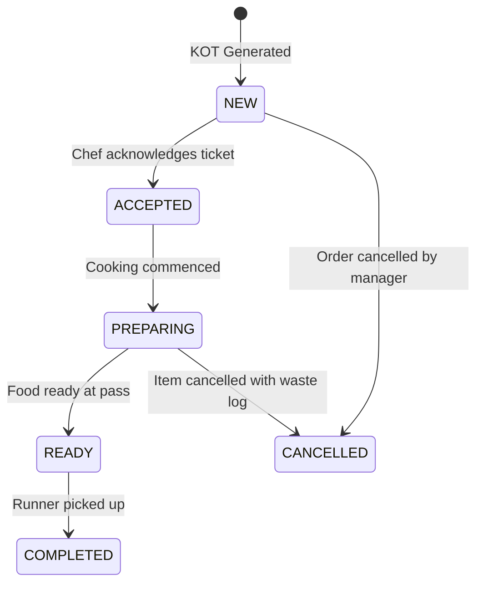

# Kitchen Order Ticket (KOT) & Kitchen Display System (KDS)

RestoVyn provides multi-station ticket routing and real-time touch KDS.

## 1. Multi-Station KOT Routing

When an order containing diverse menu items is confirmed:

1. System resolves each line item's assigned `kitchenStationId`.
2. Automatically splits the order into station-specific KOT tickets:
   - **Main Kitchen** (e.g. Biryanis, Curries)
   - **Tandoor Station** (e.g. Naans, Kebabs, Tikkas)
   - **Bar & Beverage** (e.g. Mocktails, Sodas, Coffees)
   - **Dessert Station** (e.g. Sweets, Ice creams)
   - **Chinese Wok** (e.g. Noodles, Fried Rice, Starters)
3. Dispatches tickets over WebSockets to KDS screens and queues print jobs to station thermal printers.

## 2. KDS Ticket Lifecycle

## 3. Elapsed Time Warnings

Each KDS ticket features an automatic color-coded timer:

- **0 - 10 mins**: Normal (Green badge)
- **10 - 20 mins**: Warning (Amber badge)
- **20+ mins**: Urgent (Red pulsating alert)
