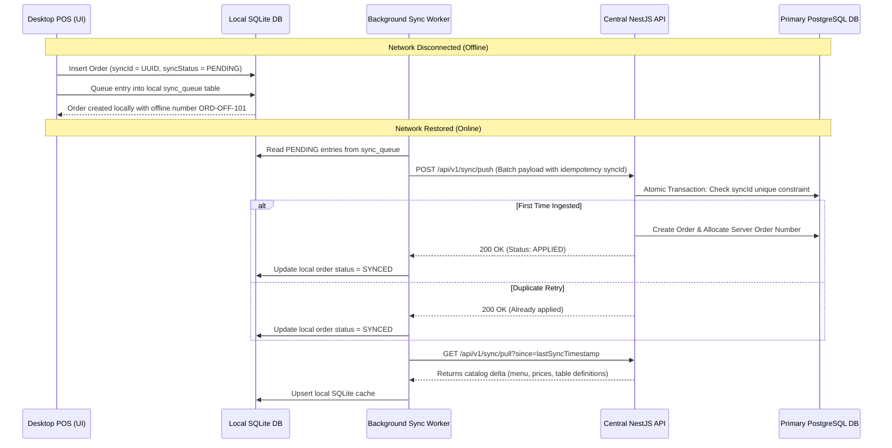

# Offline POS Synchronization Architecture

RestoVyn Desktop POS provides reliable offline operation during network disruptions.

## 1. Synchronization Flow

## 2. Conflict Resolution Policies

| Entity            | Authority           | Policy                                                                                        |
| ----------------- | ------------------- | --------------------------------------------------------------------------------------------- |
| **Menu & Prices** | Server              | Master catalog on server always overrides local cache.                                        |
| **Orders**        | State-Machine Merge | If server order is already BILLED or CANCELLED, offline amendments prompt cashier for review. |
| **Payments**      | Append-Only         | Offline cash payments are logged; online payments require live gateway verification.          |
| **Stock**         | Ledger Delta        | Offline sales emit negative delta movements rather than overriding absolute balance.          |
