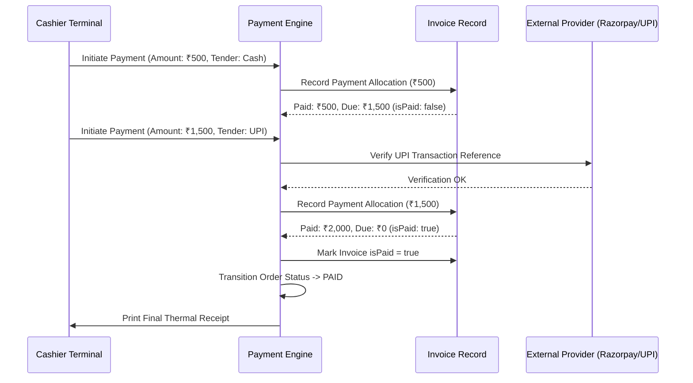

# Payment Engine & Multi-Tender Reconciliation

RestoVyn supports multiple tenders per invoice (Cash, Card, UPI, Wallets).

## 1. Multi-Tender Reconciliation Workflow

## 2. Immutability & Reversals

Financial transactions are never deleted:

- If a payment was made by error, a `Refund` or `PaymentVoid` record is appended.
- Original payment transaction remains intact for forensic audit and day-close reconciliation.
